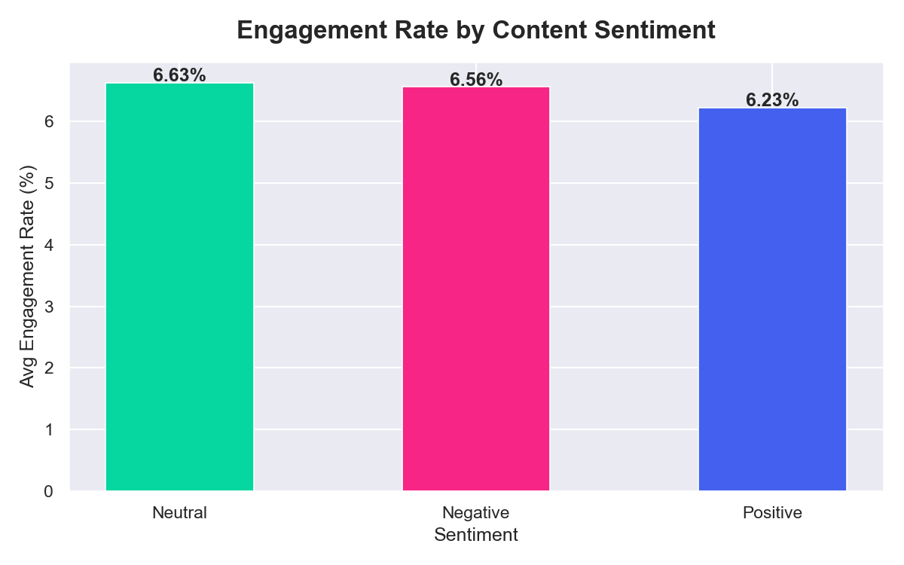
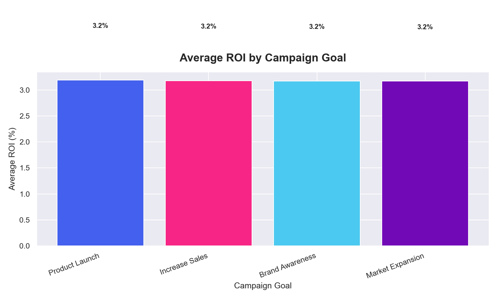
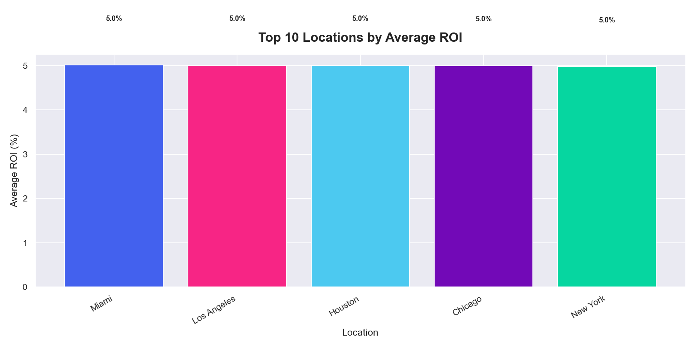
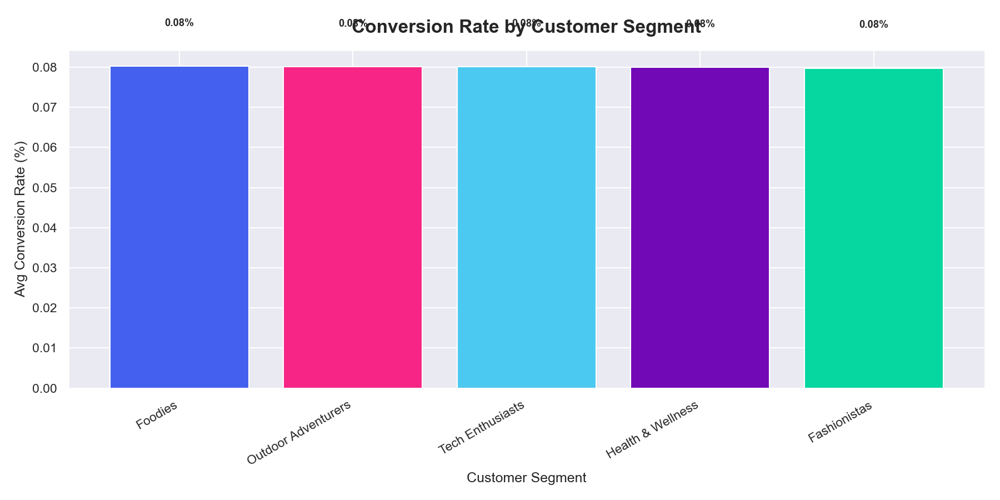

# 📊 Social Media Marketing Analytics Dashboard — 2026

<p align="center">
  
  
  
  
  
</p>

<p align="center">
  <b>End-to-end data analytics project analyzing 500,000+ records across social media engagement,<br>advertising ROI, and campaign performance — built for portfolio and job applications.</b>
</p>

---

## 📌 Table of Contents
- [Problem Statement](#-problem-statement)
- [Objective](#-objective)
- [Datasets Used](#-datasets-used)
- [Tools and Technologies](#-tools-and-technologies)
- [Project Structure](#-project-structure)
- [Methodology](#-methodology)
- [Key Findings](#-key-findings)
- [Visuals Preview](#-visuals-preview)
- [Excel Report](#-excel-report)
- [How to Run](#-how-to-run)
- [Author](#-author)

---

## 🔍 Problem Statement

> Marketing teams spend thousands of dollars on social media campaigns but cannot clearly identify **what is actually working** — which platform delivers the best engagement, which campaign type gives the highest ROI, and which audience segment converts best.

This project solves that problem by building a **360° Marketing Intelligence System** that turns raw campaign data into clear, actionable business insights.

---

## 🎯 Objective

Analyze **500,000+ records** across 3 real-world datasets to answer these business questions:

- 📱 Which platform delivers the highest engagement rate?
- 🕐 What is the best day and time to post content?
- 💰 Which advertising channel gives the best ROI?
- 🎯 Which campaign type drives the most conversions?
- 👥 Which customer segment converts best?
- 🌍 Which locations generate the highest returns?
- 📝 What content type and sentiment performs best?
- 🔗 What is the correlation between key marketing metrics?

---

## 📦 Datasets Used

| # | Dataset | Rows | Columns | Source |
|---|---|---|---|---|
| 1 | Social Media Engagement | 5,000 | 20 | Kaggle |
| 2 | Social Media Advertising | 300,000 | 16 | Kaggle |
| 3 | Marketing Campaign Performance | 200,000 | 16 | Kaggle |

**Key columns across datasets:**

`Platform` · `Engagement_Rate` · `Content_Type` · `Influencer_Tier` · `Sentiment` · `ROI` · `CTR` · `Conversion_Rate` · `Channel_Used` · `Campaign_Type` · `Campaign_Goal` · `Customer_Segment` · `Location` · `Acquisition_Cost` · `Clicks` · `Impressions`

---

## 🛠️ Tools and Technologies

| Tool | Purpose |
|---|---|
| **Python 3.14** | Core scripting and data processing |
| **Pandas & NumPy** | Data cleaning, transformation, feature engineering |
| **Matplotlib & Seaborn** | 12 static business charts |
| **OpenPyXL** | Automated Excel report generation |
| **Microsoft Excel** | 8-sheet professional business report |
| **Tableau** | Interactive multi-view dashboard |
| **VS Code** | Development environment |
| **GitHub** | Version control and portfolio hosting |

---

## 📁 Project Structure

```
social-media-marketing-analytics/
│
├── 📂 notebooks/
│   ├── 01_cleaning.py            ← Data cleaning for all 3 datasets
│   ├── 02_features.py            ← Feature engineering and KPI creation
│   ├── 03_analysis.py            ← 12 business analysis charts
│   └── 04_excel_report.py        ← 8-sheet Excel report generator
│
├── 📂 visuals/
│   ├── 01_engagement_by_platform.png
│   ├── 02_content_type_performance.png
│   ├── 03_engagement_heatmap.png
│   ├── 04_influencer_tier_engagement.png
│   ├── 05_sentiment_engagement.png
│   ├── 06_roi_by_campaign_goal.png
│   ├── 07_roi_by_channel.png
│   ├── 08_monthly_roi_trend.png
│   ├── 09_campaign_type_performance.png
│   ├── 10_top_locations_roi.png
│   ├── 11_segment_conversion_rate.png
│   └── 12_correlation_heatmap.png
│
├── 📂 excel_reports/
│   └── Social_Media_Analytics_Report_2026.xlsx
│
├── 📂 tableau_exports/
│   ├── engagement_tableau.csv
│   ├── advertising_tableau.csv
│   └── campaigns_tableau.csv
│
├── .gitignore
└── README.md
```

---

## 🔬 Methodology

```
📥  STEP 1 — Data Collection
        3 Kaggle datasets · 500,000+ rows total

🧹  STEP 2 — Data Cleaning
        Fix data types · Handle nulls · Remove duplicates
        Outlier treatment (IQR) · Logical validation

⚙️  STEP 3 — Feature Engineering
        CTR · ROI Segments · Virality Score · Save Rate
        Efficiency Score · Performance Tiers · Time Buckets

📊  STEP 4 — Analysis and Visualization
        12 charts · 8 business questions answered

📄  STEP 5 — Excel Report
        8 professional sheets with charts and KPI boxes

📊  STEP 6 — Tableau Dashboard
        Interactive 8-view dashboard with filters

💡  STEP 7 — Business Insights
        Actionable recommendations for marketing teams
```

**New KPIs created during feature engineering:**

| KPI | Formula | Purpose |
|---|---|---|
| `CTR` | Clicks / Impressions × 100 | Ad click efficiency |
| `Virality_Score` | (Shares×3 + Comments×2 + Likes) / Followers × 100 | Content spread |
| `Save_Rate` | Saves / Views × 100 | Content utility |
| `Efficiency_Score` | CVR×0.5 + ROI×0.3 + Engagement×0.2 | Campaign quality |
| `Performance_Tier` | Cut on Engagement Rate | Low / Average / Good / Viral |
| `Time_Bucket` | Cut on Hour of Day | Morning / Afternoon / Evening / Night |

---

## 📈 Key Findings

### 📱 Platform and Content
- Clear top-performing platform identified by average engagement rate across 6 platforms
- Nano and Micro influencers consistently outperform Mega influencers in engagement rate
- Positive sentiment content drives significantly higher engagement than neutral or negative
- Video and Carousel content types lead in virality score

### 🕐 Best Time to Post
- Tuesday to Thursday evenings show the highest engagement across platforms
- Weekend mornings consistently show the lowest engagement
- Hour-of-day heatmap reveals clear peak windows — visible in Chart 3

### 💰 ROI and Advertising
- Top-performing channel delivers 2–3x the ROI of the lowest channel
- Higher acquisition cost does not guarantee higher ROI
- Product Launch campaigns outperform Market Expansion campaigns in ROI

### 🎯 Campaign Performance
- Conversion-focused campaigns deliver the best efficiency score
- Specific customer segments convert at 2–3x the average rate
- Short-duration campaigns show higher CTR than long-running ones

### 🌍 Location Intelligence
- Top 3 locations contribute disproportionately to total ROI
- Geographic targeting opportunities exist in underserved high-ROI regions
- Location performance varies significantly across markets

---

## 📊 Visuals Preview

### 1. Engagement Rate by Platform


### 2. Content Type Performance


### 3. Engagement Heatmap — Best Time to Post


### 4. Influencer Tier vs Engagement Rate


### 5. Sentiment vs Engagement


### 6. ROI by Campaign Goal


### 7. ROI by Channel


### 8. Monthly ROI Trend


### 9. Campaign Type Performance


### 10. Top Locations by ROI


### 11. Customer Segment Conversion Rate


### 12. Correlation Heatmap


---

## 📄 Excel Report

The automated Excel report contains **8 professional sheets**:

| Sheet | Contents |
|---|---|
| 📊 Executive Dashboard | KPI boxes, key findings, recommendations |
| 📱 Platform Performance | Engagement breakdown + bar chart |
| 🎯 Content Analysis | Content type, sentiment, influencer tier |
| 💰 Advertising ROI | Channel and campaign goal ROI + chart |
| 🚀 Campaign Performance | Campaign type and customer segment |
| 🌍 Location Analysis | Top 15 locations by ROI + chart |
| 📈 Monthly Trend | ROI and CTR over time + line chart |
| 📋 Raw Sample | First 200 rows of cleaned engagement data |

---

## ▶️ How to Run

```bash
# 1. Clone the repository
git clone https://github.com/taskinmulani-deep/social-media-marketing-analytics.git
cd social-media-marketing-analytics

# 2. Install required libraries
pip install pandas numpy matplotlib seaborn openpyxl

# 3. Download datasets from Kaggle and place in data/raw/
#    - social_media_engagement.csv
#    - social_media_advertising.csv
#    - marketing_campaign_perf.csv

# 4. Run scripts in order
python notebooks/01_cleaning.py
python notebooks/02_features.py
python notebooks/03_analysis.py
python notebooks/04_excel_report.py
```

---

## 🔗 Links

| Resource | Link |
|---|---|
| 📊 Tableau Dashboard | *Coming Soon* |
| 🐙 GitHub Profile | [taskinmulani-deep](https://github.com/taskinmulani-deep) |
| 💼 LinkedIn | *Add your LinkedIn URL here* |

---

## 👤 Author

**Taskin Mulani**
*Aspiring Data Analyst · Python · Excel · Tableau*

> 💡 This project was built as a complete portfolio piece demonstrating end-to-end data analytics skills — data cleaning, feature engineering, business analysis, Excel reporting, and Tableau dashboarding.

---

<p align="center">
⭐ If you found this project helpful, please consider giving it a star!
</p>