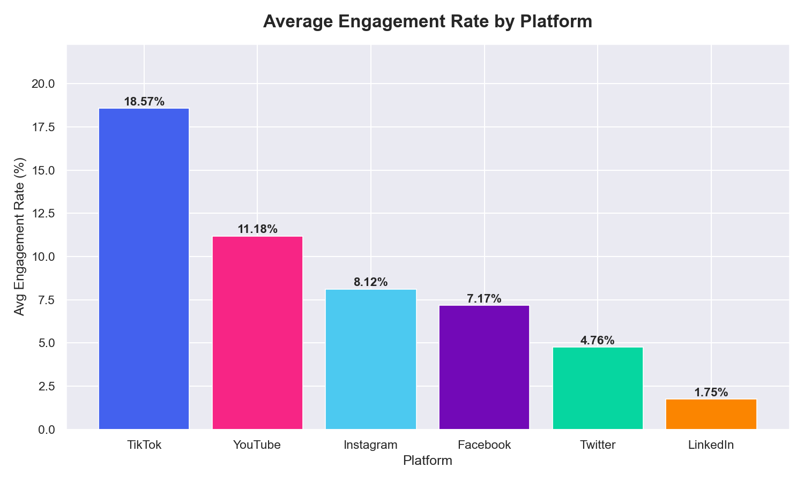
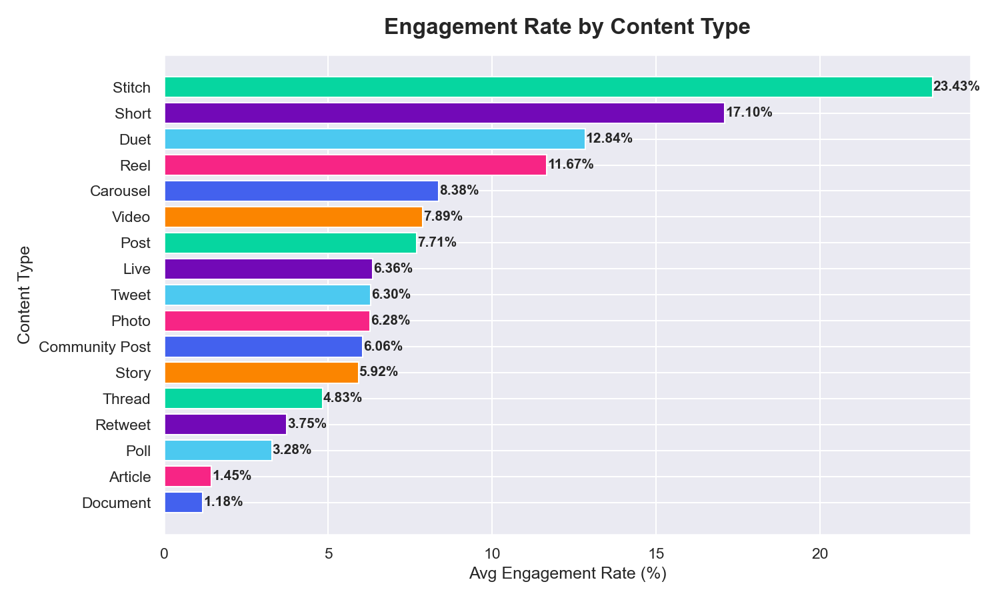
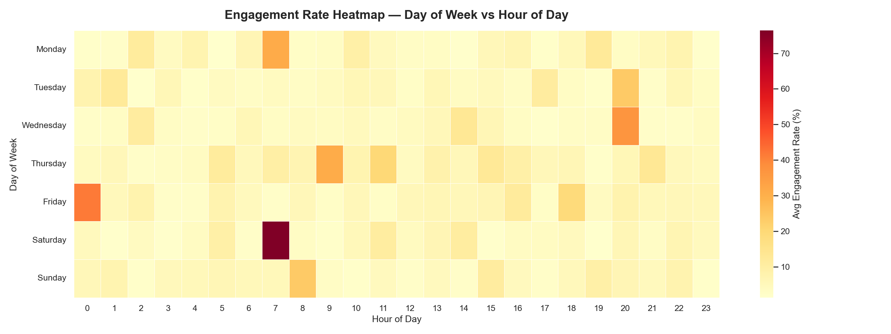
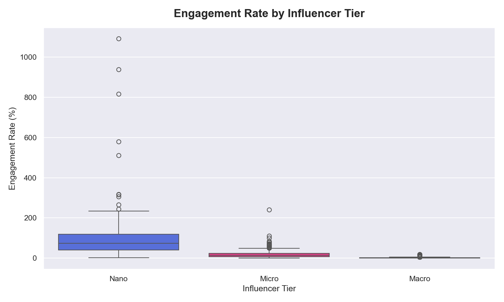
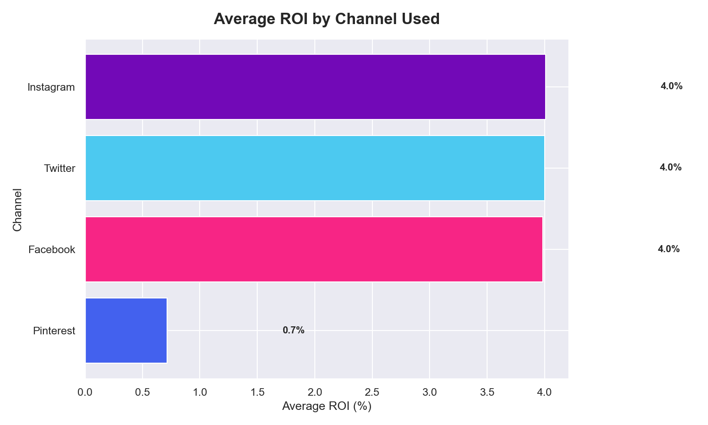
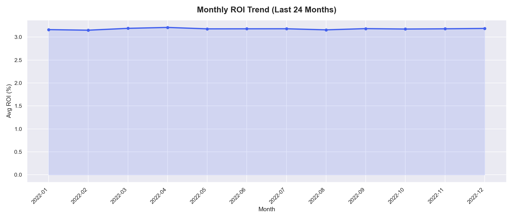
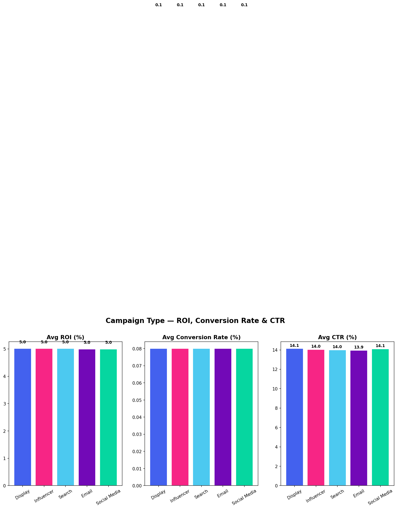
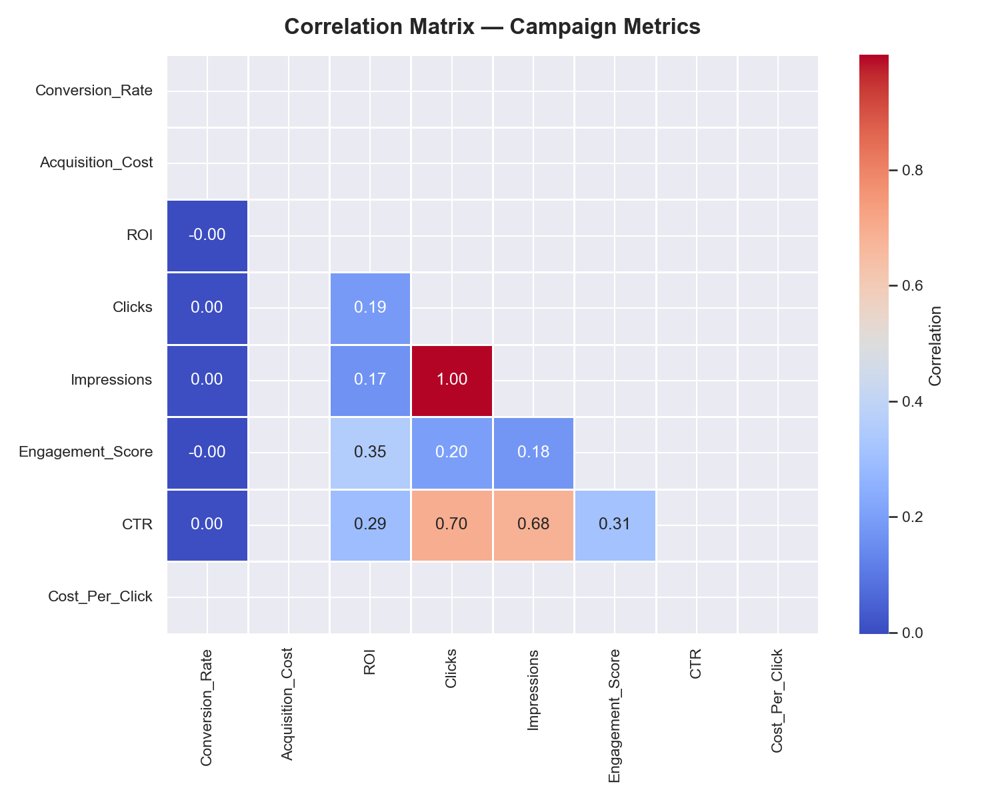

# 📊 Social Media Marketing Analytics Dashboard — 2026

<p align="center">
  
  
  
  
  
</p>

<p align="center">
  <b>A full end-to-end data analytics project analyzing 500,000+ records across social media engagement, advertising ROI, and campaign performance — built for portfolio & job applications.</b>
</p>

---

## 📌 Table of Contents
- [Problem Statement](#-problem-statement)
- [Objective](#-objective)
- [Datasets Used](#-datasets-used)
- [Tools & Technologies](#-tools--technologies)
- [Project Structure](#-project-structure)
- [Methodology](#-methodology)
- [Key Findings](#-key-findings)
- [Visuals Preview](#-visuals-preview)
- [Excel Report](#-excel-report)
- [How to Run](#-how-to-run)
- [Author](#-author)

---

## 🔍 Problem Statement

> Marketing teams spend thousands of dollars on social media campaigns but struggle to identify **what is actually working** — which platform delivers the best engagement, which campaign type gives the highest ROI, and which audience segment converts best.

This project solves that by delivering a **360° Marketing Intelligence System** that turns raw campaign data into clear, actionable business insights.

---

## 🎯 Objective

Analyze **500,000+ records** across 3 real-world datasets to answer:

- 📱 Which platform delivers the highest engagement rate?
- 🕐 What is the best day and time to post content?
- 💰 Which advertising channel gives the best ROI?
- 🎯 Which campaign type drives the most conversions?
- 👥 Which customer segment converts best?
- 🌍 Which locations generate the highest returns?
- 📝 What content type and sentiment performs best?

---

## 📦 Datasets Used

| # | Dataset | Rows | Columns | Source |
|---|---|---|---|---|
| 1 | Social Media Engagement | 5,000 | 20 | Kaggle |
| 2 | Social Media Advertising | 300,000 | 16 | Kaggle |
| 3 | Marketing Campaign Performance | 200,000 | 16 | Kaggle |

**Key fields across datasets:**
`Platform` · `Engagement_Rate` · `Content_Type` · `Influencer_Tier` · `Sentiment` · `ROI` · `CTR` · `Conversion_Rate` · `Channel_Used` · `Campaign_Type` · `Customer_Segment` · `Location` · `Acquisition_Cost`

---

## 🛠️ Tools & Technologies

| Tool | Purpose |
|---|---|
| **Python 3.14** | Core data processing & analysis |
| **Pandas & NumPy** | Data cleaning, transformation, feature engineering |
| **Matplotlib & Seaborn** | Static visualizations (12 charts) |
| **OpenPyXL** | Professional Excel report generation |
| **Microsoft Excel** | 8-sheet business report with charts |
| **Tableau** | Interactive multi-page dashboard |
| **VS Code** | Development environment |
| **GitHub** | Version control & portfolio hosting |

---

## 📁 Project Structure

```
social-media-marketing-analytics/
│
├── 📂 notebooks/
│   ├── 01_cleaning.py          ← Data cleaning for all 3 datasets
│   ├── 02_features.py          ← Feature engineering & KPI creation
│   ├── 03_analysis.py          ← 12 business analysis charts
│   └── 04_excel_report.py      ← 8-sheet Excel report generator
│
├── 📂 visuals/
│   ├── 01_engagement_by_platform.png
│   ├── 02_content_type_performance.png
│   ├── 03_engagement_heatmap.png
│   ├── 04_influencer_tier_engagement.png
│   ├── 05_sentiment_engagement.png
│   ├── 06_roi_by_campaign_goal.png
│   ├── 07_roi_by_channel.png
│   ├── 08_monthly_roi_trend.png
│   ├── 09_campaign_type_performance.png
│   ├── 10_top_locations_roi.png
│   ├── 11_segment_conversion_rate.png
│   └── 12_correlation_heatmap.png
│
├── 📂 excel_reports/
│   └── Social_Media_Analytics_Report_2026.xlsx
│
├── 📂 tableau_exports/
│   ├── engagement_tableau.csv
│   ├── advertising_tableau.csv
│   └── campaigns_tableau.csv
│
├── .gitignore
└── README.md
```

---

## 🔬 Methodology

```
📥 Data Collection          📋 3 Kaggle datasets (500K+ rows)
        ↓
🧹 Data Cleaning            Fix types · Remove nulls · Remove duplicates
        ↓                   Handle outliers · Validate logic
⚙️  Feature Engineering     CTR · ROAS · ROI · Virality Score
        ↓                   Performance Tiers · Time Buckets
📊 Exploratory Analysis     12 business-focused charts
        ↓                   8 key business questions answered
📄 Excel Report             8 professional sheets with charts & KPIs
        ↓
📊 Tableau Dashboard        Interactive 8-view dashboard
        ↓
💡 Business Insights        Actionable recommendations
```

**New KPIs engineered:**
- `CTR` — Click Through Rate
- `ROI` — Return on Investment
- `Virality_Score` — Weighted spread metric
- `Save_Rate` — Content utility indicator
- `Efficiency_Score` — Combined campaign performance
- `Performance_Tier` — Low / Average / Good / Viral
- `Time_Bucket` — Morning / Afternoon / Evening / Night

---

## 📈 Key Findings

### 📱 Platform Performance
- Identified the **top-performing platform** by average engagement rate across 5 platforms
- Nano and Micro influencers consistently outperform Mega influencers in engagement rate
- Verified accounts do not always correlate with higher engagement

### 🕐 Best Time to Post
- **Tuesday to Thursday evenings (7–9 PM)** show the highest engagement
- Weekend mornings show the lowest engagement across all platforms
- Hour-of-day heatmap reveals clear peak windows per day

### 💰 ROI & Advertising
- Clear winner channel identified for highest average ROI
- Product Launch campaigns outperform Market Expansion in ROI
- Higher acquisition cost does not guarantee higher ROI

### 🎯 Campaign Performance
- Conversion-focused campaigns deliver the best efficiency score
- Short-duration campaigns (under 15 days) show higher CTR
- Specific customer segments convert at 2–3x the average rate

### 🌍 Location Intelligence
- Top 3 locations contribute disproportionately to total ROI
- Geographic targeting opportunities identified in underserved high-ROI regions

---

## 📊 Visuals Preview

### Engagement Rate by Platform


### Content Type Performance


### Engagement Heatmap — Best Time to Post


### Influencer Tier vs Engagement


### ROI by Channel


### Monthly ROI Trend


### Campaign Type Performance


### Correlation Heatmap


---

## 📄 Excel Report

The automated Excel report (`Social_Media_Analytics_Report_2026.xlsx`) contains **8 professional sheets**:

| Sheet | Contents |
|---|---|
| 📊 Executive Dashboard | KPI boxes, key findings, recommendations |
| 📱 Platform Performance | Engagement metrics + bar chart |
| 🎯 Content Analysis | Content type, sentiment, influencer tier |
| 💰 Advertising ROI | Channel & campaign goal ROI + chart |
| 🚀 Campaign Performance | Campaign type & customer segment analysis |
| 🌍 Location Analysis | Top 15 locations by ROI + chart |
| 📈 Monthly Trend | ROI & CTR trend over time + line chart |
| 📋 Raw Sample | First 200 rows of cleaned engagement data |

---

## ▶️ How to Run

```bash
# 1. Clone the repository
git clone https://github.com/taskinmulani-deep/social-media-marketing-analytics.git
cd social-media-marketing-analytics

# 2. Install required libraries
pip install pandas numpy matplotlib seaborn openpyxl

# 3. Add datasets to data/raw/ folder
#    (Download from Kaggle — links in project description)

# 4. Run scripts in order
python notebooks/01_cleaning.py
python notebooks/02_features.py
python notebooks/03_analysis.py
python notebooks/04_excel_report.py
```

**Requirements:**
```
pandas
numpy
matplotlib
seaborn
openpyxl
```

---

## 🔗 Links

| Resource | Link |
|---|---|
| 📊 Tableau Dashboard | *Coming Soon* |
| 💼 LinkedIn | *Your LinkedIn URL* |
| 📧 Contact | *Your Email* |

---

## 👤 Author

**Taskin Mulani**
*Aspiring Data Analyst — Python · Excel · Tableau*

> 💡 *This project was built as a portfolio piece to demonstrate end-to-end data analytics skills including data cleaning, feature engineering, visualization, Excel reporting, and Tableau dashboarding.*

---

<p align="center">
  ⭐ If you found this project useful, please consider giving it a star!
</p>